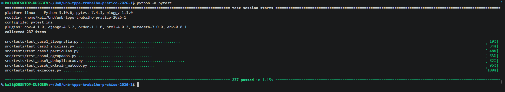

# Relatório Consolidado de Engenharia de Software: Refatoração da Arquitetura

## 1. Introdução
Este documento apresenta a conclusão do Trabalho Prático 2 da disciplina Técnicas de Programação para Plataformas Emergentes (TPPE). A partir do motor em estado verde desenvolvido no TP1, o grupo aplicou com sucesso três operações formais de refatoração para otimizar o design, a coesão e o acoplamento do sistema de curadoria científica.

---

## 2. Sumário das Operações de Refatoração Aplicadas

O grupo realizou as três alterações obrigatórias previstas para o Grupo 16, organizadas conforme a tabela de diretrizes do enunciado:

| Operação | Alvo Original | Destino / Estrutura Gerada |
| :--- | :--- | :--- |
| **Extrair Classe** | Classe `Curador` | Criação de `ProcessadorTextoCientifico` em `src/processador.py` |
| **Substituir Método por Objeto-Método** | `Curador::pontuar_nome()` | Criação da classe especialista `PontuadorNome` |
| **Extrair Método** | `Curador::assinatura()` | Criação dos métodos privados `_tokenizar_nome()`, `_extrair_sobrenome()` e `_obter_primeira_inicial()` |

---

## 3. Detalhamento e Justificativa Técnica

### A. Extrair Classe
* **Problema Original:** A classe `Curador` acumulava tarefas de infraestrutura textual de baixo nível (como limpeza de acentos, apóstrofos e espaços) e regras estratégicas de negócio.
* **Solução:** Toda a manipulação de strings foi movida para a nova classe `ProcessadorTextoCientifico`. O `Curador` agora interage com essa infraestrutura por meio de composição e delegação pura de comportamento.

### B. Substituir Método por Objeto-Método
* **Problema Original:** O método `pontuar_nome()` continha variáveis temporárias e um acúmulo procedural de pontos em um estado local.
* **Solução:** A lógica matemática de pontuação foi convertida na classe autônoma `PontuadorNome`. Os cálculos agora possuem ciclo de vida próprio e atributos de instância dedicados, o que facilita alterações futuras nas regras de pesos e penalidades do score.

### C. Extrair Método
* **Problema Original:** O método `assinatura()` concentrava três responsabilidades num único corpo procedural: a normalização/tokenização da entrada, um bloco complexo de condicionais para adivinhar a posição do sobrenome e uma varredura que montava uma lista de iniciais apenas para consumir seu primeiro elemento.
* **Solução:** Cada responsabilidade foi extraída para um método privado dedicado — `_tokenizar_nome()`, `_extrair_sobrenome()` e `_obter_primeira_inicial()`. O corpo de `assinatura()` passou a ser uma composição linear e declarativa dessas três etapas, eliminando ainda a variável temporária `iniciais`. As sub-rotinas tornaram-se testáveis isoladamente, com uma nova suíte dedicada (`tests/test_caso6_extrair_metodo.py`).

---

## 4. Conclusão e Avaliação de Impacto
Todas as operações ocorreram sem o uso de ferramentas automatizadas de refatoração, o que exigiu análise estrita de escopo e tipagem. O resultado gerou um código limpo, de alta manutenibilidade e extensível.

Como principal critério de validação, a suíte de testes do projeto foi mantida intacta e executada após cada entrega:

